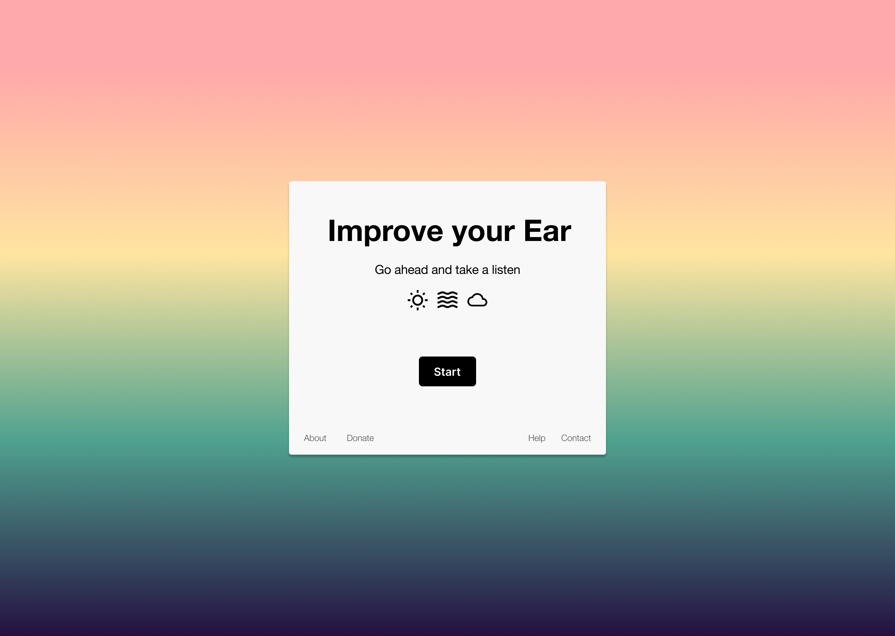
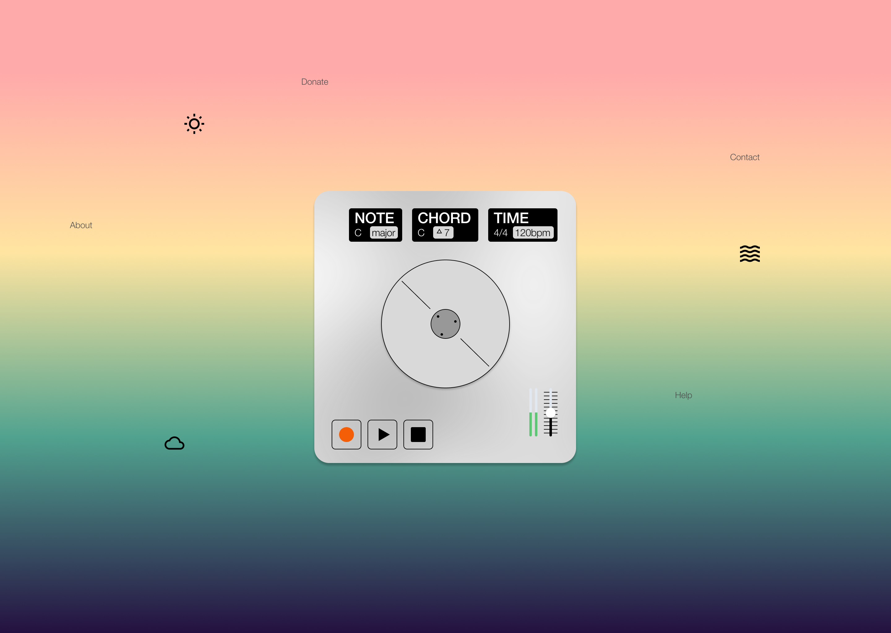

# improvEar

*Your friendly musical ear building tool*

 

## Getting Started

Install the dependencies

```bash
npm install
```

Run the dev server

```bash
npm run dev
```

## Main libraries
- [tone](https://tonejs.github.io/) - audio interfacing
- [chakra-ui](https://v2.chakra-ui.com/) - pre-built components
- [tailwind](https://tailwindcss.com/) - general styling and custom components
- [framer-motion](https://www.framer.com/motion/) - animations
- [prettier](https://prettier.io/) - formatting 

## Contribution
Read our [contribution guide](./contributing.md) to help out :)


